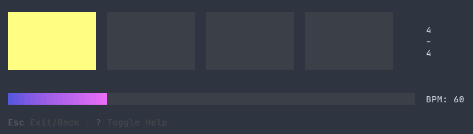

# tick
A terminal metronome written in Go

### Features:
- Change BPM/time signature while running
- Tap out custom speed
- Dynamically start/stop
- Makes tick sound with [Beep](https://github.com/faiface/beep)/ALSA
- Accurate time intervals using `time.Ticker`

#### Build:
```shell
$ go build
```

#### Run:
```shell
$ ./tick
```


